

# TideInspire
 
## 建设背景
基于移动应用APP安全状况的脆弱性以及攻击威胁的严重性，我国开始重视移动应用的安全问题，并将其上升到国家战略的高度，相关的主管部门正积极的开展移动应用APP安全工作。为确保我省移动应用APP的备案、上线、安全风险等可知可控，山东新潮自研开发了一套移动应用APP安全管控平台，主要实现移动应用APP备案管理、APP生存周期管理、移动应用基本信息检测、移动应用恶意行为检测、移动应用安全规范检测、移动应用渠道监测、钓鱼伪造APP安全监测、通报预警服务、威胁感知服务等，并能对移动应用APP进行源码安全漏洞检测、协议安全漏洞检测、数据安全检测等全方面自动化安全检测服务。

## TideInspire介绍

TideInspire(潮启)是由新潮信息Tide安全团队（www.tidesec.net）自主研发推出的一款移动端安全管控平台。通过对APP进行安全监测，完善APP发布者备案制度、APP软件安全检测制度，注重发现和避免恶意扣费、隐私窃取、远程控制、恶意传播、资费消耗、系统破坏、诱骗诈取、流氓行为等行为的发生。
移动应用APP安全管控平台可对移动应用市场山东省内的APP进行安全检查和风险评估，提高APP的安全防护能力。并出具应用检测报告，可作为移动应用开发商提供专业的安全加固数据依据。

**地址**：<http://app.sdsecurity.org.cn>  或 <http://app.tidesec.net>

## 主要功能
#### 一、APP安全检测

**（1）自动化APP扫描**

潮启移动端安全管控平台可根据配置对APP进行自动扫描，还可设置定时扫描、扫描周期等相关功能，以满足用户多元化需求。

**（2）专项漏洞检测**

潮启移动端安全管控平台可对常见漏洞进行插件检测，如ZipperDown、应用克隆和超级拒绝服务等漏洞进行验证。在新漏洞爆发时，用户可利用该功能进行针对性检测。

**（3）敏感信息检测**

潮启移动端安全管控平台可采用全文检索、应用目录枚举、图片文件检查等手段对APP进行敏感信息检测，并对发现的敏感信息进行导出，从而协助用户对APP进行有效监管。

**（4）漏洞生命期管理**

潮启移动端安全管控平台可记录漏洞的概念以及漏洞的整个生命周期，包括漏洞的产生、发现、公开、管理和消亡，并详细介绍漏洞在生命周期中每个阶段的成因、形式、发现方法和具体的应对措施。

#### 二、APP安全监测

**（1）伪造APP监测服务**

对各大移动应用市场进行深度爬取，采用智能算法识别伪造或钓鱼APP，通过动静结合方式实现实时监测并记录相关样本特征库。

**（2）恶意行为监测服务**

通过比对各类APP权限调用情况，在用户未授权的情况下获取涉及用户个人信息的行为，采用静态检测方式进行判断，实时监测存在调用系统等危险权限行为。

**（3）敏感字监测**

潮启移动端安全管控平台具备文本识别技术,敏感词库进行实时更新，可实现高效敏感词检索，还可进行自定义敏感词，进行智能甄别。

#### 三、APP备案管理

**（1）APP基本信息**

对APP名称、包名、运营单位、分类、历史版本、更新时间、服务器信息进行识别。

**（2）APP任务管理**

对APP进行任务下发、查询检索、漏洞扫描等。

#### 四、报告及告警

**（1）监测预警**

1、定期对APP进行检测，通过服务器响应时间对服务质量进行判断；

2、定期对APP进行安全检测发现漏洞及时预警。

**（2）专项报告**

通过poc 脚本和前期对APP应用识别结果、批量对该APP进行漏洞检测，针对漏洞进行专项分析，并生成报告。

#### 五、其他

**（1）APP漏洞人工审查**

对拒绝服务漏洞、命令执行等高危漏洞进行人工验证，确定该漏洞是否有效，并根据验证结果修改最终报告。

**（2）重点漏洞修复专题材料**

针对重点高危漏洞、制作专题资料，报告漏洞起因、受影响版本，和加固检测方案等。

**（3）钓鱼APP关停协助**

对检测中发现的钓鱼APP，保存相关资料，为协助网警执法提供帮助。

## 前台展示
#### 前台主界面
* 上传APP主界面，在上传APK框中上传APP文件。

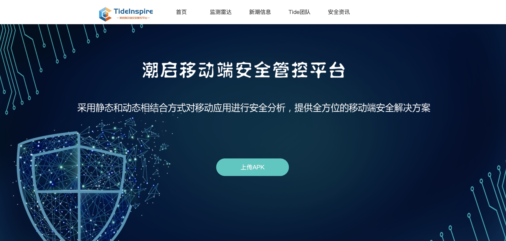

#### 数据统计
* 对辖区范围内APP风险检测数据进行汇总展示，对各漏洞数量占比进行图表展示。
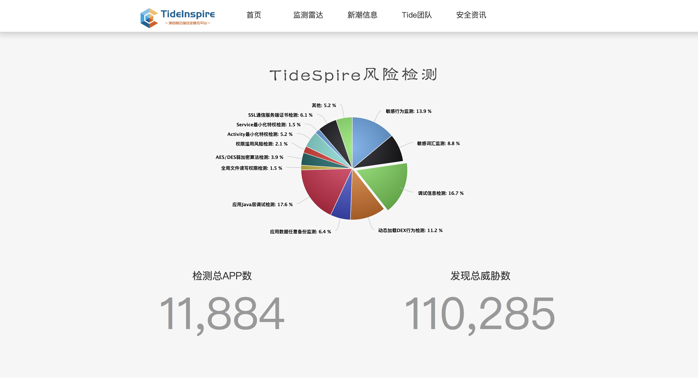

#### APP查询
* 查询APP是否收录及基本信息展示。
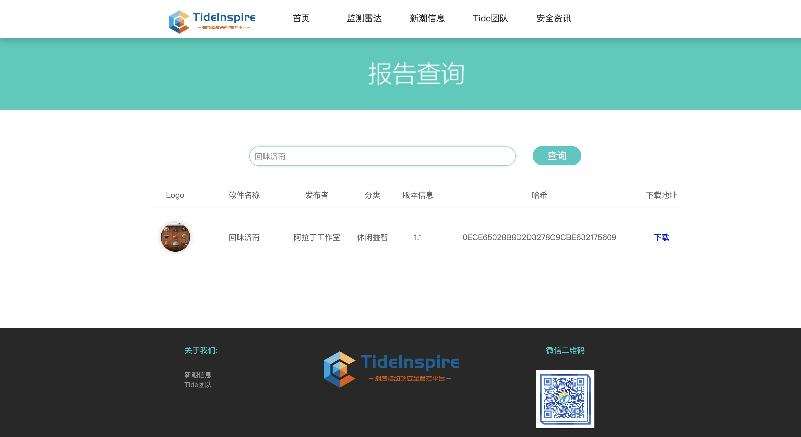

#### 检测详情
* 应用信息检测：应用名称、包名、文件大小、版本信息和文件MD5
* 应用签名信息检测：所有者、发布者、序列号、有效期开始日期、截止日期和证书指纹。
* 应用行为信息检测
* 应用权限信息检测
* 敏感词检测
* 敏感函数检测
* 敏感行为检测
* 动态加载DEX行为检测
* 第三方SDK检测
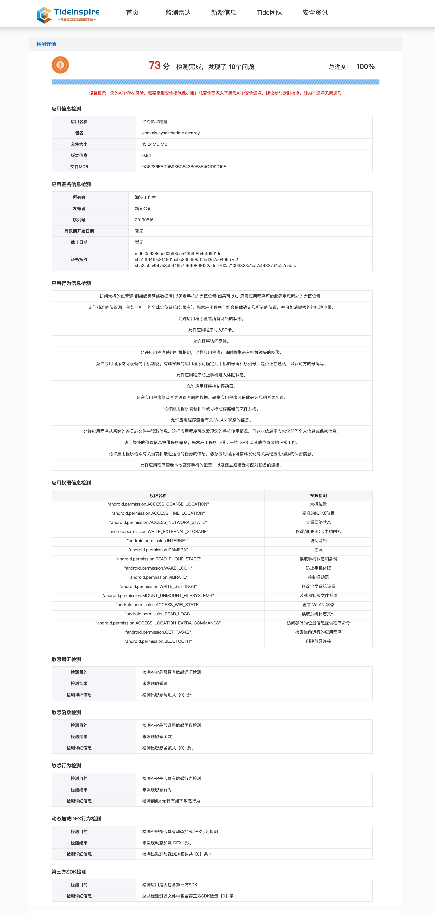

#### APP漏洞检测
* 根据设置的检查项对APP进行漏洞分析和安全检测。
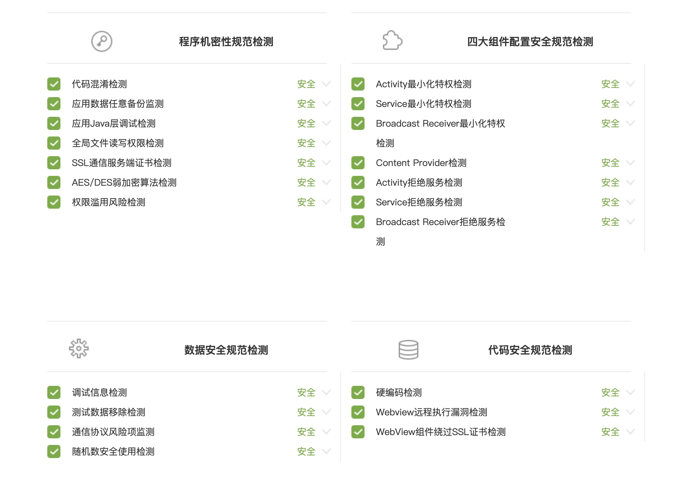

#### 监测雷达
* 安全监测：对APP程序的安全漏洞、APP恶意行为、APP漏洞分布、APP地区分布以及扫描数量进行图表统计展示。
* 渠道监测：实时监测国内多个应用市场，可及时发现钓鱼伪造APP、老旧版本APP等相关数据。
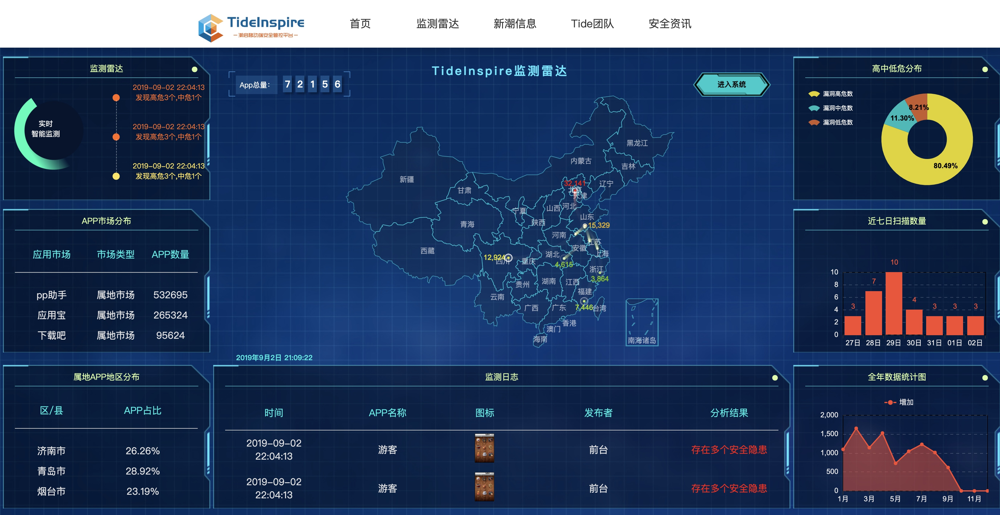

## 后台管理
#### 管理控制台
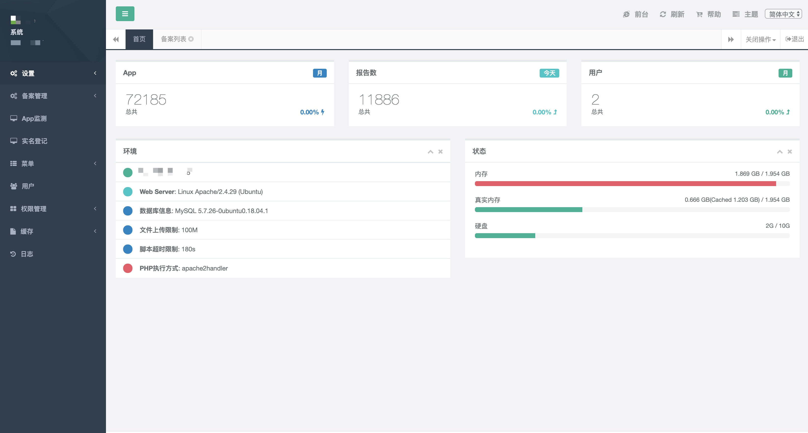

#### 备案管理
* 备案列表
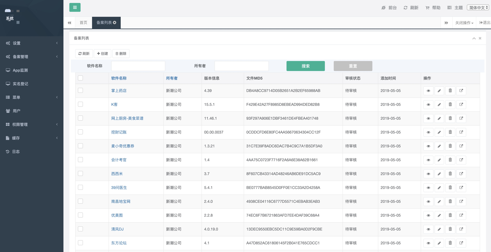
* 备案详情
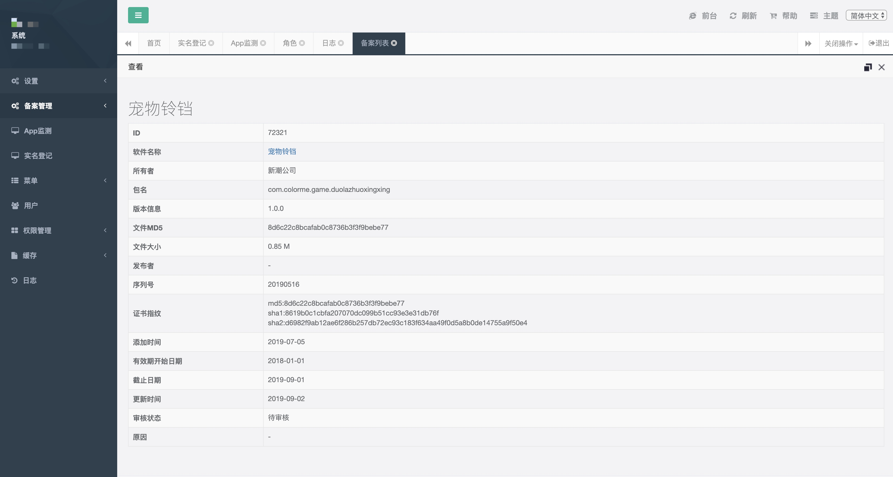

#### APP监测
* APP监测管理列表

* APP监测详情

#### 实名登记
* 实名登记管理
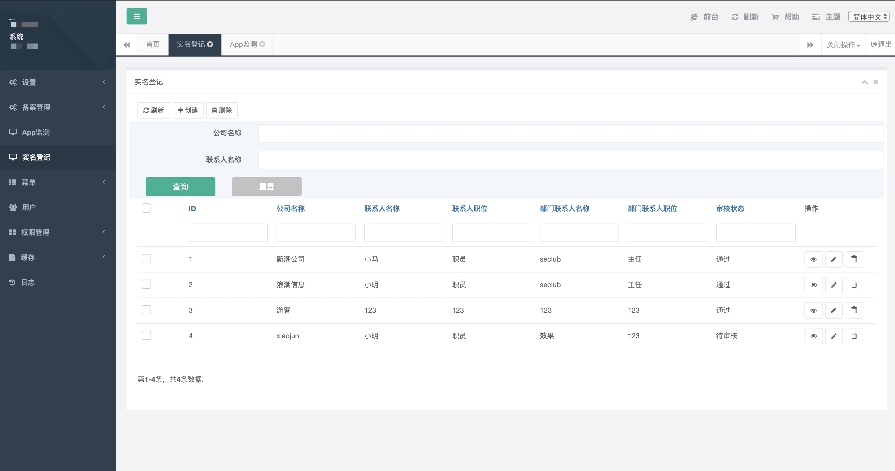
* 实名登记详情
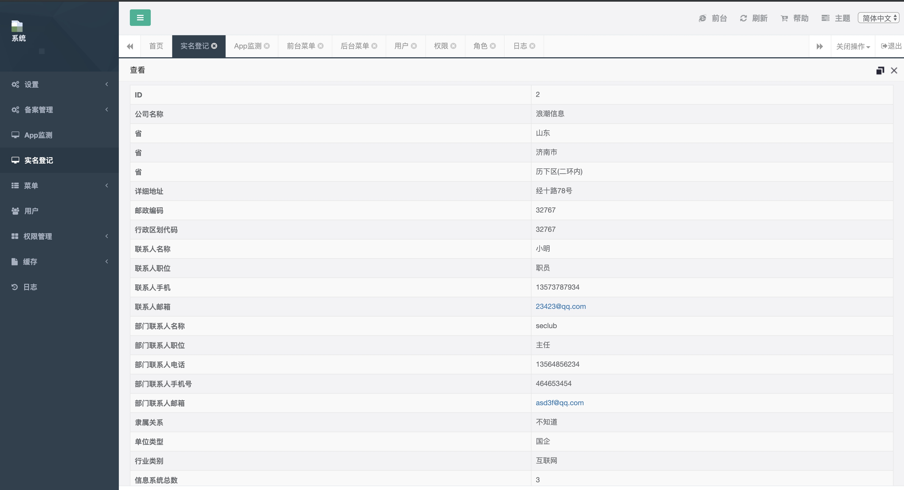

#### 用户管理
系统管理模块主要为管理员提供便利。主要功能包括：
**（1）权限管理**：为不同使用权限的用户进行权限的分类授权。
**（2）用户管理**：添加、删除、修改用户信息。
* 用户管理列表
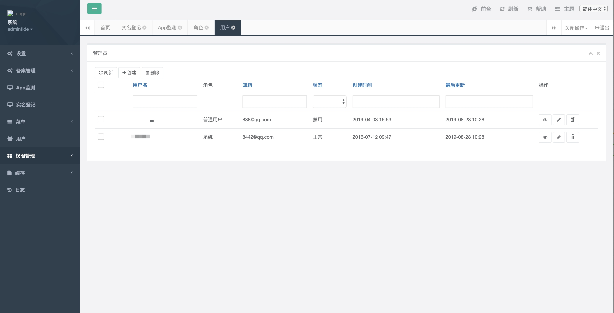
* 注册用户权限管理

#### 报告展示
* APP安全检测评估报告展示
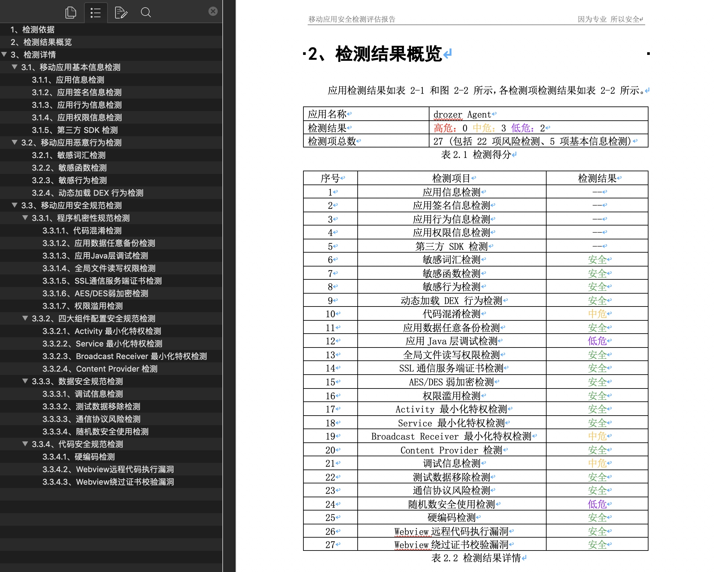

# 关注我们

**TideSec安全团队：**

Tide安全团队正式成立于2019年1月，是以互联网攻防技术研究为目标的安全团队，目前聚集了十多位专业的安全攻防技术研究人员，专注于网络攻防、Web安全、移动终端、安全开发、IoT/物联网/工控安全等方向。

想了解更多Tide安全团队，请关注团队官网: http://www.TideSec.net 或关注公众号：

