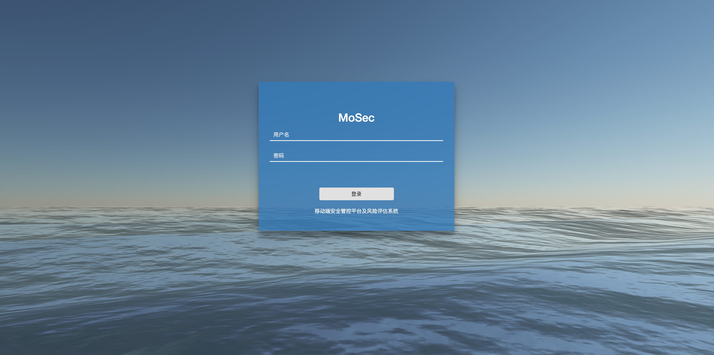

<div align=center></div>

# TideInspire

移动端安全管控平台——移动应用基本信息检测、恶意行为检测、安全规范检测、渠道监测、钓鱼伪造监测、通报预警服务等

```
tips:目前已经实现APP生命周期管理、APP漏洞扫描、安全规范检测等~~APP恶意行为检测和协议分析是个难题~~

```

# Change Log

- [2019-01-12] 实现对应用市场的APP监测
- [2019-01-05] 实现APP基本信息检测、静态检测等
- [2018-12-12] 规划整体架构
 
# Abstract

平台主要实现移动应用APP基本信息管理、APP生存周期管理、移动应用基本信息检测、移动应用恶意行为检测、移动应用安全规范检测、移动应用渠道监测、钓鱼伪造APP安全监测、通报预警服务、威胁感知服务等，并能对移动应用APP进行源码安全漏洞检测、协议安全漏洞检测、数据安全检测等全方面自动化安全检测服务。




# ToDo

- 尽量完善各种功能，早日面世


# 关注我们

**TideSec安全团队：**

Tide安全团队正式成立于2019年1月，是以互联网攻防技术研究为目标的安全团队，目前聚集了十多位专业的安全攻防技术研究人员，专注于网络攻防、Web安全、移动终端、安全开发、IoT/物联网/工控安全等方向。

想了解更多Tide安全团队，请关注团队官网: http://www.TideSec.net 或关注公众号：

<div align=center></div>

